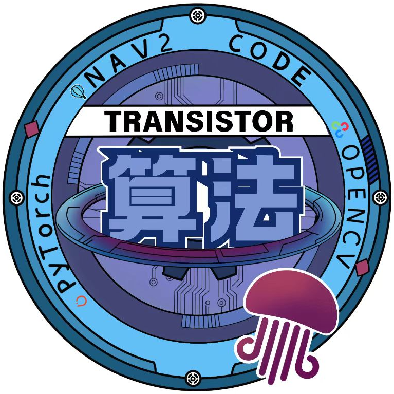

# buaa_sentry_relocalization

<div style="text-align: center;">
  
</div>

借鉴了北极熊导航对重定位的目标与相应的技术路线拟定，结合[Kiss_MATCHER](https://github.com/MIT-SPARK/KISS-Matcher)作为粗配准给出一个粗糙的定位信息，以及[Small_gicp](https://github.com/koide3/small_gicp)作为精配准在粗配准的的基础上迭代求解，在仿真中大概实现了无先验位姿的重定位算法。

## 1. 环境配置流程

### 0. tools文件夹创建

```bash
mkdir -p ~/tools && cd ~/tools
```

### 1. Small_gicp

```bash
mkdir -p ~/tools && cd ~/tools
```
```bash
sudo apt install -y libeigen3-dev libomp-dev
```
```bash
git clone https://github.com/koide3/small_gicp.git
```
```bash
cd small_gicp
```
```bash
mkdir build && cd build
```
```bash
cmake .. -DCMAKE_BUILD_TYPE=Release && make -j
sudo make install
```

### 3. Kiss_MATCHER

```bash
mkdir -p ~/tools && cd ~/tools
```
```bash
git clone https://github.com/MIT-SPARK/KISS-Matcher.git
```
```bash
cd KISS-Matcher
```
```bash
make deps & make cppinstall
```

## 2. 调参教程

TBD